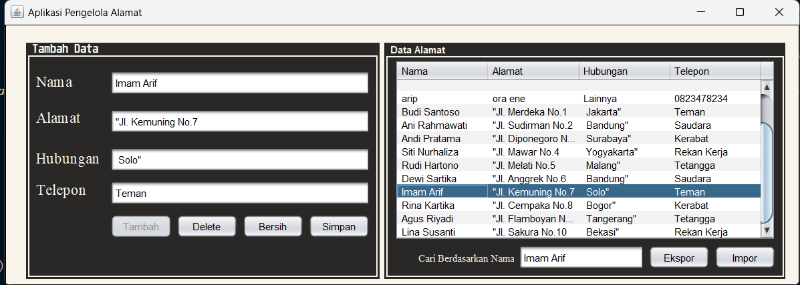

# AlamatGUI Application

AlamatGUI adalah aplikasi berbasis Java Swing yang dirancang untuk mengelola data alamat. Aplikasi ini memungkinkan pengguna untuk menambahkan, memperbarui, menghapus, mencari, mengimpor, dan mengekspor data alamat. Data dikelola menggunakan database SQLite dan dapat dilihat atau diedit melalui antarmuka pengguna grafis (GUI).

---

## Fitur
- **Tambah Data**: Menambahkan data baru langsung ke database dan menampilkannya di tabel.
- **Edit Data**: Memperbarui data yang ada berdasarkan baris yang dipilih.
- **Hapus Data**: Menghapus data dari tabel dan database.
- **Cari Nama**: Mencari data berdasarkan nama melalui kolom pencarian.
- **Impor Data**: Mengimpor data dari file CSV.
- **Ekspor Data**: Mengekspor data ke file CSV.

---

## Teknologi yang Digunakan
- **Java Swing**: Untuk antarmuka pengguna grafis (GUI).
- **SQLite**: Sebagai database untuk menyimpan data alamat.
- **JDBC (Java Database Connectivity)**: Untuk koneksi ke database SQLite.

---

## Instalasi
1. **Persyaratan**:
   - Java Development Kit (JDK) versi 8 atau lebih baru.
   - File `sqlite-jdbc.jar` untuk koneksi database.

2. **Langkah-langkah**:
   - Clone atau unduh proyek ini.
   - Tambahkan `sqlite-jdbc.jar` ke classpath proyek Anda.
   - Pastikan database SQLite (`AlamatDB.db`) berada di lokasi yang sesuai dengan konfigurasi aplikasi.

3. **Menjalankan Aplikasi**:
   - Jalankan file `AlamatGUI.java` dari IDE Anda (NetBeans, IntelliJ IDEA, atau lainnya).

---

## Struktur Database
Tabel `Alamat` digunakan untuk menyimpan data alamat. Berikut adalah strukturnya:

| Kolom     | Tipe Data | Deskripsi                  |
|-----------|-----------|----------------------------|
| `id`      | INTEGER   | Primary key (auto increment). |
| `nama`    | TEXT      | Nama kontak.              |
| `alamat`  | TEXT      | Alamat kontak.            |
| `hubungan`| TEXT      | Hubungan dengan kontak.   |
| `telepon` | TEXT      | Nomor telepon kontak.     |

---

## Panduan Penggunaan

### 1. Menambah Data
- Isi semua kolom input (Nama, Alamat, Hubungan, Telepon).
- Klik tombol **Tambah**.
- Data akan disimpan ke database dan ditampilkan di tabel.

### 2. Mengedit Data
- Pilih baris pada tabel.
- Data akan muncul di kolom input.
- Edit data sesuai kebutuhan, lalu klik tombol **Simpan**.

### 3. Menghapus Data
- Pilih baris pada tabel.
- Klik tombol **Delete**.
- Konfirmasi penghapusan, lalu data akan dihapus.

### 4. Mencari Data
- Ketik nama di kolom pencarian.
- Tabel akan otomatis memfilter data berdasarkan input.

### 5. Mengekspor Data
- Klik tombol **Ekspor**.
- Pilih lokasi dan nama file CSV.
- Data tabel akan disimpan ke file CSV.

### 6. Mengimpor Data
- Klik tombol **Impor**.
- Pilih file CSV untuk diimpor.
- Data dari file CSV akan ditambahkan ke tabel.

---

## Struktur Proyek

```plaintext
src/
├── FormView/
│   ├── AlamatGUI.java         # File utama aplikasi GUI.
├── Database/
│   ├── Koneksi.java           # Koneksi ke database SQLite.
├── data_alamat.csv            # File CSV untuk data contoh.
```

---

## Screenshot

### Home View


### Alamat GUI View



---

## Penulis

**Nama**: Muhamad Arif Syamrodi  
**NPM**: 2210010316

---

## Kontribusi
Kontribusi selalu diterima! Jika Anda menemukan bug atau ingin menambahkan fitur baru, silakan buat pull request atau buka issue.

---

## Lisensi
Proyek ini menggunakan lisensi MIT. Silakan baca file `LICENSE` untuk informasi lebih lanjut.
```

---

